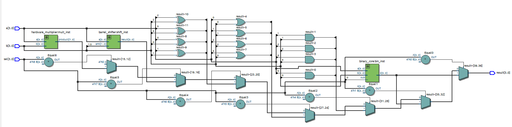
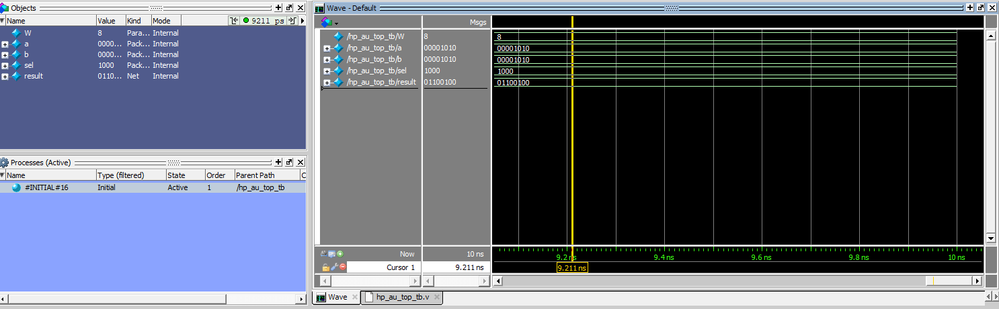

# HP-AU: High Performance Arithmetic Unit 
### Projeto de Aceleração de Hardware em Verilog HDL


## 📌 Sobre o Projeto
A **HP-AU (High Performance Arithmetic Unit)** é uma Unidade Lógica e Aritmética (ALU) projetada em nível RTL (*Register Transfer Level*). O projeto foca na implementação de arquiteturas de alto desempenho, otimização de caminho crítico e escalabilidade de hardware.

Este projeto é o **Artefato Prático Final** do Módulo Básico do **Programa CI Digital (Softex/MCTI)**, desenvolvido para validar competências em design digital e modelagem HDL.

## 🎓 Contexto Acadêmico
Este repositório documenta a progressão técnica nas seguintes disciplinas de Pós-Graduação:
* **SD112:** Introdução ao Verilog (Modelagem de Hardware).
* **SD122:** Circuitos Digitais I (Lógica Combinacional e Aritmética).
* **SD192:** Trabalho Orientado I (Implementação e Síntese).

## 🚀 Roadmap de Evolução

O projeto foi construído de forma incremental, onde cada fase resolveu um gargalo específico de hardware:

| Fase | Módulo | Problema Resolvido | Teoria Aplicada |
| :--- | :--- | :--- | :--- |
| **01** | `setup` | Fluxo de trabalho. | Ambiente Quartus/ModelSim. |
| **02** | `binary_core` | Soma/Subtração base. | Ripple Carry Adder (RCA). |
| **03** | `bcd_core` | Base decimal. | Correção Aritmética +6. |
| **04** | `cla_4bit` | **Atraso de Propagação.** | **Carry Look-Ahead (CLA):** Delay $O(1)$. |
| **05** | `barrel_shifter` | Deslocamentos lentos. | Shifters Combinacionais. |
| **06** | `hardware_mult` | Multiplicação em software. | Multiplicador de Hardware e Truncamento. |
| **07** | **IP CORE** | **Falta de Escalabilidade.** | **Parametrizção:** Design genérico via `WIDTH`. |

## 📊 Síntese Lógica (RTL Viewer)

Abaixo, a representação física gerada após a síntese. O design demonstra uma arquitetura paralela, onde todos os núcleos processam os dados simultaneamente, sendo selecionados pelo estágio final de multiplexação.

> 

## 💎 Diferencial Técnico: IP Core Parametrizável (Fase 07)

A HP-AU foi refatorada para atuar como um **IP Core**. Através da propagação de parâmetros ($WIDTH$), o hardware se ajusta automaticamente à largura de barramento desejada sem necessidade de reescrita de código.

### ✅ Validação de Escalabilidade (8-bit Proof)
Para provar a robustez do design, o parâmetro global foi alterado para **8 bits** no Testbench, realizando a operação $10 \times 10$:
* **Resultado Obtido:** $100$ (`01100100_2`).
* **Conclusão:** O hardware expandiu com sucesso, eliminando o truncamento de 4 bits e provando a integridade da arquitetura parametrizada.

> 

## 🛠️ Estrutura do Repositório

```text
HP_AU/
├── rtl/                  # Código-fonte Verilog (Módulos Parametrizados)
│   ├── hp_au_top.v       # Top Level (Integração e Mux Final)
│   ├── cla_4bit.v        # Somador de Alta Performance
│   ├── barrel_shifter.v  # Deslocador de Bits
│   └── hardware_mult.v   # Multiplicador Nativo
├── tb/                   # Testbenches de Verificação
│   └── hp_au_top_tb.v    # Teste de Integração e Regressão
├── docs/                 # Evidências, Logs e Waveforms
└── README.md             # Documentação do Projeto

```

## ⚡ Como Executar

1. Importe os arquivos da pasta `rtl/` no **Intel Quartus Prime**.
2. Execute a Análise e Síntese para verificar o mapeamento do hardware.
3. Utilize o **ModelSim** para rodar o `hp_au_top_tb.v`.
4. Altere o `parameter WIDTH` para testar diferentes larguras de barramento.

---

---
**Desenvolvido por Victor Coelho** *Bacharel em Ciência e Tecnologia (UFMA) | Graduando em Engenharia de Computação (UFMA)* *Pós-graduando em Microeletrônica (UEMA) | Analista de Infraestrutura e Redes (DPE-MA)*


